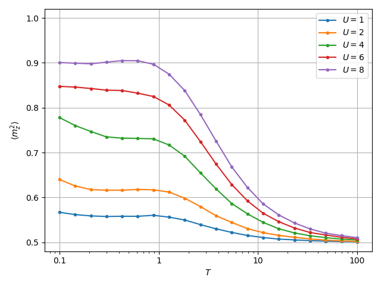

# DQMC


[](https://github.com/dylanljones/dqmc/actions/workflows/build.yml)
[](https://github.com/dylanljones/dqmc/actions/workflows/test-all-master.yml)


Efficient and stable Determinant Quantum Monte Carlo (DQMC) simulations of the Hubbard model in Python.

| :warning: **WARNING**: This project is still in development and might contain errors or change significantly in the future! |
|-----------------------------------------------------------------------------------------------------------------------------|

Uses just in time compilation (jit) and optional Fortran implementations for
the most expensive methods of the Determinant Quantum Monte Carlo iteration
to achieve efficient simulations accesable through a Python interface. The
computation of the inversion of cyclic matrices is stabilized via the ASvQRD
(Accurate Solution via QRD with column pivoting) algorithm (see Ref [6]) in
order to obtain better results at low temperatures.

1. [Installation](#installation)
2. [Quickstart](#quickstart)
3. [Examples](#examples)
4. [API Usage](#api-usage)
5. [ToDo](#todo)
6. [References](#references)

## Installation

Install via `pip` from github:
```commandline
pip install git+https://github.com/dylanljones/dqmc.git@VERSION
```
or download/clone the package, navigate to the root directory and install via
````commandline
pip install -e <folder path>
````
or the `setup.py` script
````commandline
python setup.py install
````

Run the `Makefile` to compile the Fortran source code!


## Quickstart

To run a simulation, run the `python -m dqmc` command with a configuration text file
as parameter, for example:
````commandline
python -m dqmc examples/chain.txt
````
Multiple simulations can be run by supplying keyword arguments. The command
````commandline
python -m dqmc examples/chain.txt -mp 4 -hf -u 1 ... 4 -p moment
````
will run the DQMC simulation with the parameters of the file for the interaction
strengths `1, 2, 3, 4` at half filling (`-hf`) and plot the local moment.
In order to use multiprocessing the number of processes can be specified by the
`-mp` argument. Use
````commandline
python -m dqmc --help
````
for more information.

### Parameters of input files

- `shape`
   The shape of the lattice model.
- `U`
   The interaction strength of the Hubbard model.
- `eps`
   The on-site energy of the Hubbard model.
- `t`
   The hopping energy of the Hubbard model.
- `mu`
   The chemical potential of the Hubbard model. Set to `0` for half filling.
- `dt` (optional)
   The imaginary time step size.
- `beta` (optional)
   The inverse temperature. Can be set instead of `dt`.
- `temp` (optional)
   The temperature. Can be set instead of `dt`.
- `L`
   The number of imaginary time slices
- `nequil`
   The number of warmup-sweeps
- `nsampl`
   The number of measurement-sweeps
- `nwraps` (optional)
   The number of time slice wraps after which the Green's functions are recomputed.
   The default is 1.
- `prodLen` (optional)
   The number of explicit matrix products used for the stabilized matrix product
   via ASvQRD. If 0 no stabilization is performed. The default is 1.
- `recomp`  (optional)
   Integer flag if the Green's functions are recomputed before performing
   measurements (1) or not (0). The default is 1.

## Examples

See the `examples` directory and the `run_examples.py` script.

### Local moment

Average local moment `<n_↑> + <n_↓> - 2 <n_↑ n_↓>` as a function of temperature
for different interaction strengths `U` at half filling:

|                 chain.txt                  |                  square.txt                  |
|:------------------------------------------:|:--------------------------------------------:|
|  |  |

The local moment begins to develop from its uncorrelated value `1/2` at a temperature
set by `U`, and then saturate at low `T`. The local moment does not reach `1` at
low temperatures because significant quantum fluctuations allow doubly occupied
and empty sites to occur even in the ground state. However, as `U` increases,
these fluctuations are suppressed and the moment becomes better and better formed.


## API Usage

### Initializing the Hubbard model

In order to run a simulation, a Hubbard model has to be constructed. This can be
done manually by initializing the included `HubbardModel`:
```python
import numpy as np
from dqmc import HubbardModel

# Initialize a square Hubbard model
vectors = np.eye(2)
model = HubbardModel(vectors, u=4., eps=0., hop=1., mu=0., beta=1/5)
model.add_atom()          # Add an atom to the unit cell
model.add_connections(1)  # Set nearest neighbor hoppings

# Build the lattice with periodic boundary conditions along both axis
model.build((5, 5), relative=True, periodic=(0, 1))
```
or by using the helper function `hubbard_hypercube` to construct a `d`-dimensional
hyper-rectangular Hubbard model with one atom in the unit cell and nearest neighbor
hopping:
```python
from dqmc import hubbard_hypercube

shape = (5, 5)
model = hubbard_hypercube(shape, u=4., eps=0., hop=1., mu=0., beta=1/5, periodic=True)
```
Setting `periodic=True` marks all axis as periodic.

### Running simulations and measuring observables

To run a Determinant Quantum Monte carlo simulation the `DQMC`-object can be used.
This is a wrapper of the main DQMC methods, which are contained in `dqmc/dqmc.py`
and use jit (just in time compilation) to improve performance:
```python
from dqmc import hubbard_hypercube, mfuncs, DQMC

shape = (5, 5)
num_timesteps = 100
warmup, measure = 300, 3000
model = hubbard_hypercube(shape, u=4., eps=0., hop=1., mu=0., beta=1/5, periodic=True)

dqmc = DQMC(model, num_timesteps, num_recomp=1, prod_len=1, seed=0)
results, out = dqmc.simulate(warmup, measure, callback=mfuncs.occupation)
```
The `simulate`-method measures the observables
- `gf_up`:
   The spin-up Green's function `<G_↑>`.
- `gf_dn`:
   The spin-up Green's function `<G_↓>`.
- `n_up`:
   The spin-up occupation `<n_↑>`.
- `n_dn`:
   The spin-down occupation `<n_↓>`.
- `n_double`:
   The double occupation `<n_↑ n_↓>`.
- `local_moment`:
   The local moment `<n_↑> + <n_↓> - 2 <n_↑ n_↓>`.
- `out`:
   The result of the user callback (returns `0` if no callback is passed)

Additionally, the `simulate`-method has a `callback` parameter for measuring observables, which
expects a method of the form
```python
def callback(gf_up, gf_dn, signs, *args, **kwargs):
    ...
    return result
```
where `gf_up` and `gf_dn` are the spin up and down Green's functions and `signs`
is an array of the spin up and down sign of the GF determinant after the DQMC iteration.
The returned result must be a `np.ndarray` for ensuring correct averaging after the
measurement sweeps. A collection of methods for measuring observables is contained
in the `mfuncs` module.

The above steps can be simplified by creating a `Parameter` object and calling the `run_dqmc`-method.
```python
from dqmc import run_dqmc, mfuncs, Parameters

shape = 10
u, eps, mu, hop = 4.0, 0.0, 0.0, 1.0
dt = 0.05
num_timesteps = 100
warmup, measure = 300, 3000
p = Parameters(shape, u, eps, hop, mu, dt, num_timesteps, warmup, measure)

gf_up, gf_dn, n_up, n_dn, n_double, moment, occ = run_dqmc(p, callback=mfuncs.occupation)
```
The default observables are returned first, folled by the result of the callback (`0`
if no callback is passed).

### Multiprocessing

To run multiple DQMC simulations in parallel use the `run_dqmc_parallel`-method,
which internally calls the `run_dqmc`-method. A list of `Parameters`-objects
can be created via the `map_params`-method:

```python
from dqmc import map_params, run_dqmc_parallel

params = map_params(p, u=[1, 2, 3, 4, 5])
results = run_dqmc_parallel(params, max_workers=4)
```


## ToDo

ToDo's:

- Add more observables to default equal-time measurements
- Unequal-time measurements
- Mulit-orbital models
- Improve performance
- Stabilize for lower temperatures
- Improve Fortran implementations
- Checkpoints
- Parallelize measurement sweeps


Before submitting pull requests, run the lints, tests and optionally the
[black](https://github.com/psf/black) formatter with the following commands
from the root of the repo:
`````commandline
python -m black dqmc/
pre-commit run
`````
or install the pre-commit hooks by running
`````commandline
pre-commit install
`````

## References
1. Z. Bai, W. Chen, R. T. Scalettar and I. Yamazaki
   "Numerical Methods for Quantum Monte Carlo Simulations of the Hubbard Model"
   Series in Contemporary Applied Mathematics, 1-110 (2010) [DOI](https://doi.org/10.1142/9789814273268_0001)
2. S. R. White, D. J. Scalapino, R. L. Sugar, E. Y. Loh, J. E. Gubernatis and R. T. Scalettar
   "Numerical study of the two-dimensional Hubbard model"
   Phys. Rev. B 40, 506-516 (1989) [DOI](https://doi.org/10.1103/PhysRevB.40.506)
3. P. Broecker and S. Trebst
   "Numerical stabilization of entanglement computation in auxiliary field quantum Monte Carlo simulations of interacting many-fermion systems"
   Phys. Rev. E 94, 063306 (2016) [DOI](https://doi.org/10.1103/PhysRevE.94.063306)
4. J. E. Hirsch
   "Two-dimensional Hubbard model: Numerical simulation study"
   Phys. Rev. B 31, 4403 (1985) [DOI](https://doi.org/10.1103/PhysRevB.31.4403)
5. J. E. Hirsch
   "Discrete Hubbard-Stratonovich transformation for fermion lattice models"
   Phys. Rev. B 29, 4159 (1984) [DOI](https://doi.org/10.1103/PhysRevB.28.4059)
6. Z. Bai, C.-R. Lee, R.-C. Li and S. Xu
   "Stable solutions of linear systems involving long chain of matrix multiplications"
   Linear Algebra Appl. 435, 659-673 (2011) [DOI](https://doi.org/10.1016/j.laa.2010.06.023)
7. C. Bauer
   "Fast and stable determinant quantum Monte Carlo"
   SciPost Phys. Core 2, 11 (2020) [DOI](https://doi.org/10.21468/SciPostPhysCore.2.2.011)
